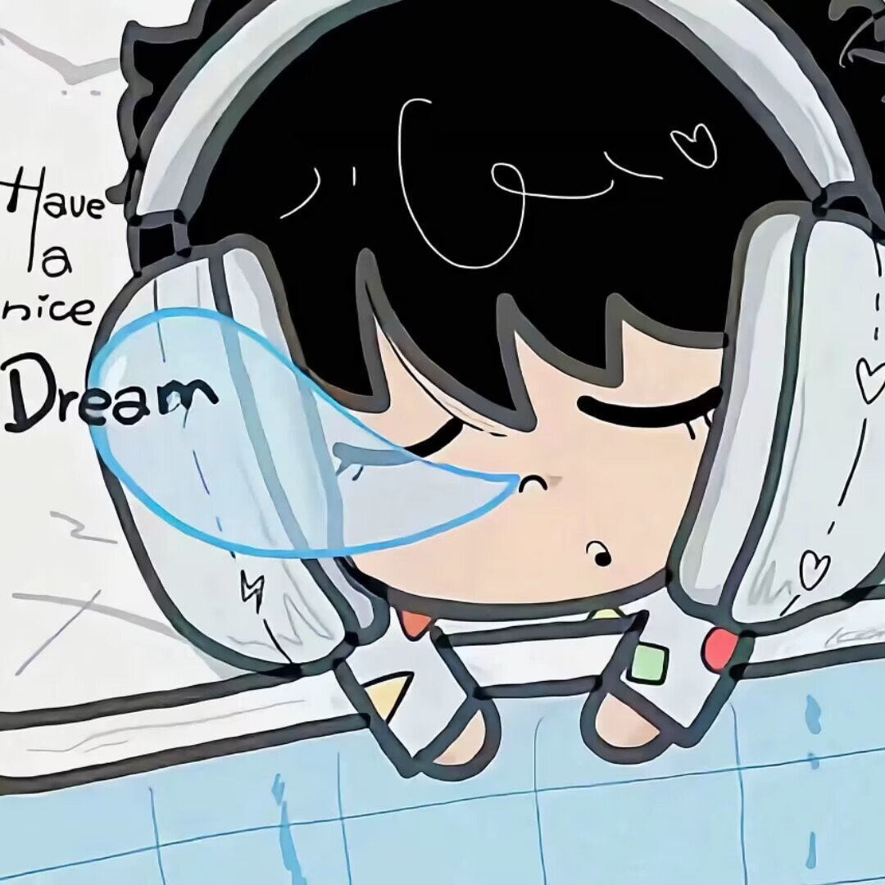
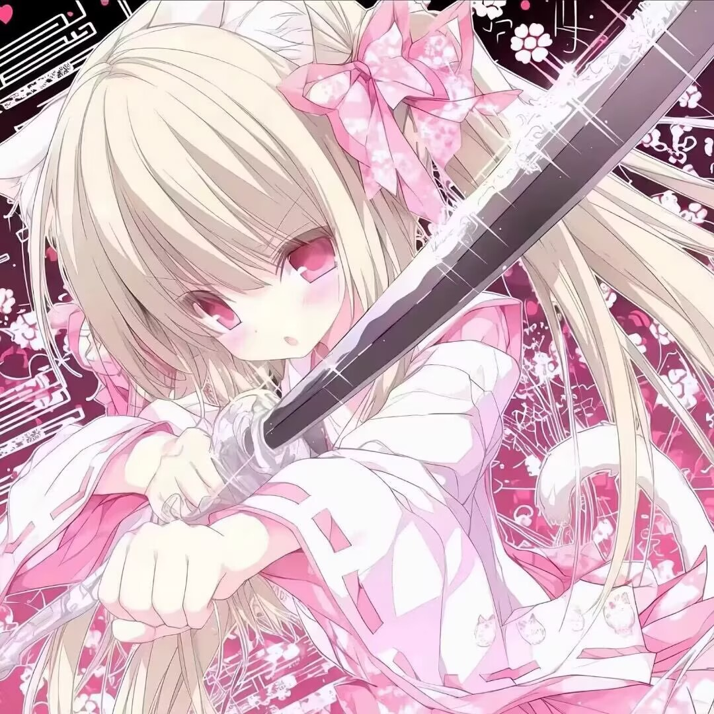
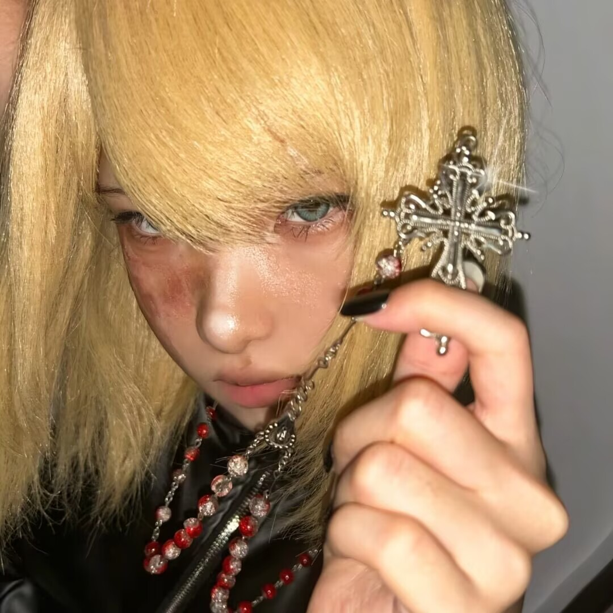
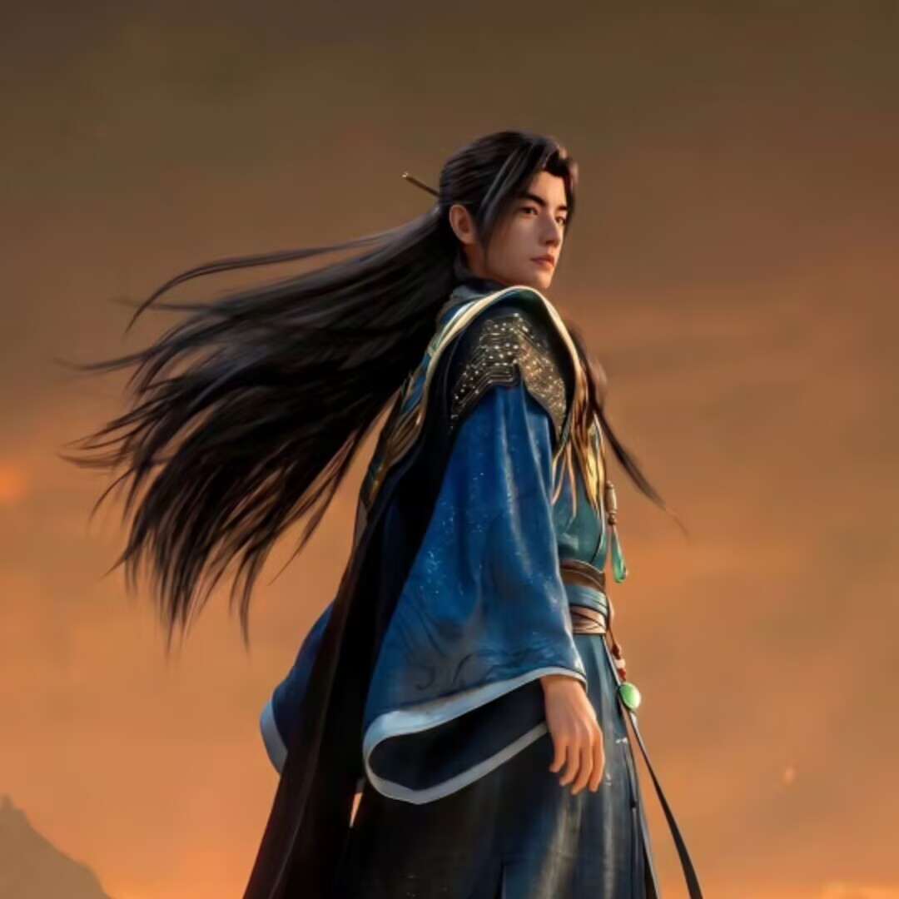
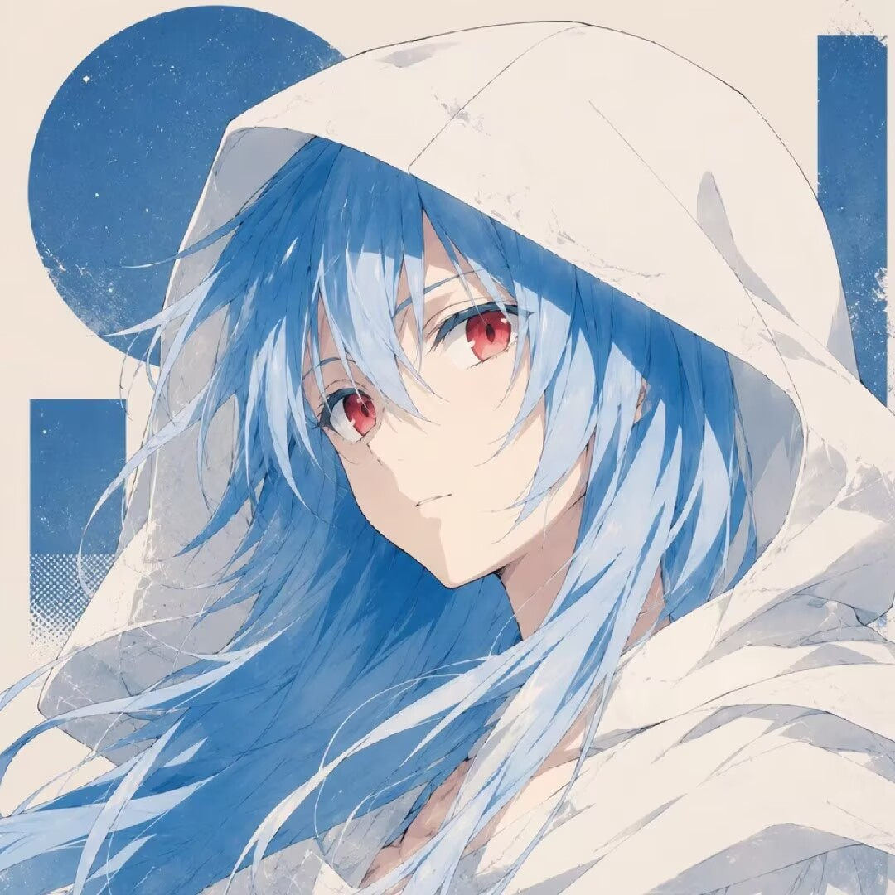
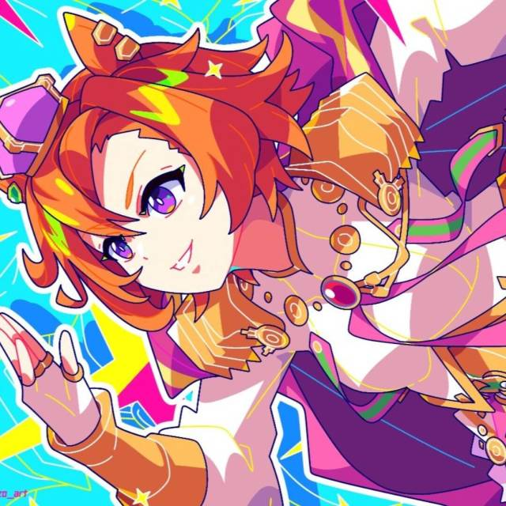
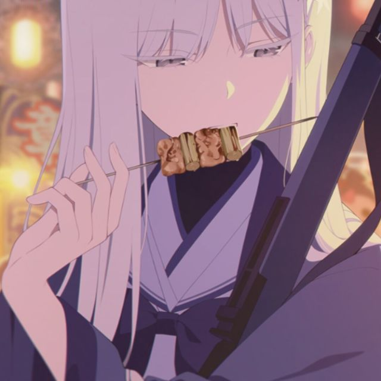

# 《火影忍者》手游4945区二组首领线角色场景卡 v1

> 文档状态：可供写作使用的角色设计稿  
> 剧情范围：2026年7月17日—7月21日  
> 对应路线：玩家创建二组“江南”并成为首领  
> 事实依据：[《4945区剧情基线-v1.md》](./4945区剧情基线-v1.md)  
> 结构依据：[《4945区可玩剧情结构-v1.md》](./4945区可玩剧情结构-v1.md)  
> 头像来源：[《头像》目录](./头像/)  

## 0. 使用说明

本稿服务于下一阶段的30—45分钟垂直切片，回答以下问题：

1. 每名角色在7月17日至21日想要什么。
2. 每名角色知道什么、不知道什么。
3. 谁拥有游戏组织权限，谁只拥有外部群聊权限。
4. 玩家作出不同选择后，角色为什么支持、观望、反对或离开。
5. 角色在群聊中如何保持可辨识，但不被写成单一标签。
6. 用户提供的头像怎样与角色稳定绑定。

### 0.1 信息标签

| 标签 | 含义 |
|---|---|
| 已确认 | 来自用户补充或事实基线，可以作为默认历史使用 |
| 结构设定 | 为使二组首领路线可玩而建立，可以继续调整 |
| 语言建议 | 只约束说话功能和节奏，不是已经发生过的真实原话 |
| 视觉记录 | 只描述头像中直接可见的构图与颜色，不推断现实身份或性格 |
| 待确认 | 当前不能安全写死的事实 |

### 0.2 头像使用边界

- 文件名只用于把用户整理的头像绑定到角色。
- 头像外观不作为人物性格、性别、年龄或现实身份的证据。
- 真人照片风头像只记录画面构成，不推断照片中的人与玩家本人是否相同。
- 多数扩展名为“.png”的文件实际采用JPEG编码；现阶段保留原文件名，避免破坏用户已有整理和后续引用。
- 头像风格不统一是正常的玩家群像特征，不建议强行重绘成同一种画风。

## 1. 头像资产索引

头像目录原有20个可用角色文件；另在“头像/生成补全-v1”中新增8个剧情角色头像。系统文件“.DS_Store”不作为素材。

| 角色 | 文件 | 像素 | 本切片用途 |
|---|---|---:|---|
| 夏娜 | [夏娜.png](./头像/夏娜.png) | 1079×1079 | 核心角色 |
| 辰逸 | [辰逸.png](./头像/辰逸.png) | 1080×1080 | 核心角色 |
| 岸 | [岸.png](./头像/岸.png) | 1080×1080 | 核心角色 |
| 时 | [时.png](./头像/时.png) | 1080×1080 | 核心角色 |
| 大古 | [大古.png](./头像/大古.png) | 1080×1080 | 核心角色 |
| takemehand | [takemehand.png](./头像/takemehand.png) | 1080×1080 | 核心角色 |
| 希露菲 | [希露菲.png](./头像/希露菲.png) | 1080×1080 | 核心角色 |
| 祈福 | [祈福.png](./头像/祈福.png) | 1080×1080 | 核心外部角色 |
| 心跳成瘾 | [心跳成瘾.png](./头像/心跳成瘾.png) | 1080×1080 | 三组首领支援角色 |
| 砚秋水 | [砚秋水png.png](./头像/砚秋水png.png) | 1080×1080 | 四组首领支援角色 |
| 华月乌大王 | [华月乌大王.png](./头像/华月乌大王.png) | 1080×1080 | 四组后续角色，切片内可作群聊背景 |
| 玄末之缘 | [玄末之缘.png](./头像/玄末之缘.png) | 1080×1080 | 四组强硬派，切片内可作群聊背景 |
| 将进酒 | [将进酒.png](./头像/将进酒.png) | 1080×1080 | 四组温和派，切片内可作群聊背景 |
| 告白 | [告白.png](./头像/告白.png) | 1080×1080 | 五组后续主战角色，切片尾声可露面 |
| yyT | [yyT.png](./头像/yyT.png) | 1080×1080 | 第六组织后续角色 |
| 皇帝 | [皇帝.png](./头像/皇帝.png) | 1080×1080 | 第六组织后续角色 |
| 我是骚鸡 | [我是骚鸡.png](./头像/我是骚鸡.png) | 1080×1080 | 二组成员群像 |
| 剑斩凡人心 | [剑斩凡人心-2组精英.png](./头像/剑斩凡人心-2组精英.png) | 1080×1080 | 二组稳定核心群像 |
| 好歌剧 | [好歌剧-2组成员.jpg](./头像/好歌剧-2组成员.jpg) | 640×640 | 二组成员群像 |
| 路人K | [路人K-原5组高层现2组成员.jpg](./头像/路人K-原5组高层现2组成员.jpg) | 640×640 | 后续跨组织成员；身份依据文件名，待纳入事实基线 |
| 先上号再说 | [先上号再说.png](./头像/生成补全-v1/先上号再说.png) | 1254×1254 | 老玩家朋友 |
| 顶级奶瓶 | [顶级奶瓶.png](./头像/生成补全-v1/顶级奶瓶.png) | 1254×1254 | 一组高层 |
| 死辛 | [死辛.png](./头像/生成补全-v1/死辛.png) | 1254×1254 | 二组稳定成员 |
| 真理 | [真理.png](./头像/生成补全-v1/真理.png) | 1254×1254 | 三组高层 |
| OguriC | [OguriC.png](./头像/生成补全-v1/OguriC.png) | 1254×1254 | 五组转入三组的核心人物 |
| 温陷 | [温陷.png](./头像/生成补全-v1/温陷.png) | 1254×1254 | 五组首领 |
| 剑问白玉京 | [剑问白玉京.png](./头像/生成补全-v1/剑问白玉京.png) | 1254×1254 | 五组重建角色 |
| AVUCII | [AVUCII.png](./头像/生成补全-v1/AVUCII.png) | 1254×1254 | 六组接班与合并角色 |

### 1.1 当前缺少的头像

- 玩家主角：应由玩家自选或保持系统默认头像。
- 排名背景人物抖音战导林鹿、千解、只学数学尚未进入主要场景，因此暂不生成。
- 尚未获得姓名的组织高层不建立占位头像。

当前缺口不阻塞二组线垂直切片。主角继续保留玩家自定义权，不建立唯一官方形象。

## 2. 二组线职位与权限快照

### 2.1 7月19日晚

| 角色 | 游戏组织身份 | 二组管理权限 | 外部4945区群权限 | 备注 |
|---|---|---|---|---|
| 玩家 | 二组首领 | 完整首领权限 | 由群主或管理员单独授予 | 所有组织级决定必须由玩家作出 |
| 夏娜 | 无正式职位的核心顾问 | 无，除非玩家任命 | 普通群成员 | 默认历史首领在玩家路线中的替代身份 |
| 辰逸 | 二组高层 | 有 | 普通群成员 | 高层槽位一 |
| 岸 | 二组高层 | 有 | 普通群成员 | 高层槽位二 |
| 时 | 二组成员或核心 | 无 | 普通群成员 | 7月19日从五组加入 |
| 大古 | 二组普通成员 | 无 | 普通群成员 | 此前已经在二组 |
| takemehand | 二组普通成员 | 无 | 普通群成员 | 尚未离组 |
| 希露菲 | 二组成员 | 无 | 初始为普通群成员 | 加入二组的准确日期待确认 |

### 2.2 7月20日默认改组后

| 角色 | 游戏组织身份 | 二组管理权限 | 变化原因 |
|---|---|---|---|
| 玩家 | 二组首领 | 完整 | 不变 |
| 夏娜 | 核心顾问 | 无 | 继续提供意见，不替玩家决定 |
| 辰逸 | 普通成员 | 无 | 因公开冲突被降级 |
| 岸 | 普通成员 | 无 | 自己不想继续担任高层，主动卸任 |
| 时 | 二组高层 | 有 | 补入空出的高层位置 |
| 大古 | 二组高层 | 有 | 从原二组普通成员晋升 |
| takemehand | 四组成员 | 无二组权限 | 禁言后离开二组 |
| 希露菲 | 二组成员 | 无二组管理权限 | 仍可能获得外部区群管理员 |

### 2.3 两套权限不能混写

- 游戏组织首领、高层权限属于《火影忍者》手游组织系统。
- 4945区群的群主、管理员权限属于外部聊天平台。
- 辰逸能在二组群实施禁言，不代表能在游戏服务器封禁玩家。
- 希露菲骗到区群管理员，不代表她真的成为任何游戏组织高层。
- 玩家是二组首领，也不天然拥有祈福控制的旧4945区群权限。

## 3. 核心关系与矛盾

| 关系 | 7月19日表面状态 | 隐含张力 | 7月21日默认结果 |
|---|---|---|---|
| 玩家—夏娜 | 共同建立二组 | 谁提供意见，谁承担最终责任 | 夏娜支持拒绝与一组开战 |
| 玩家—辰逸 | 首领与高层 | 辰逸需要职位被看见，玩家需要权限可控 | 辰逸降为普通成员 |
| 玩家—岸 | 首领与高层 | 玩家需要管理人手，岸不想承担管理 | 玩家接受其主动卸任 |
| 玩家—时 | 首领与新成员 | 时跨组而来，动机尚不透明 | 时成为高层 |
| 玩家—大古 | 首领与普通成员 | 大古没有显眼政治履历，却可能更适合执行 | 大古成为高层 |
| 辰逸—takemehand | 高层与成员 | “未回应”被解释成“不尊重” | 禁言、离组、截图外流 |
| 玩家—希露菲 | 首领与老区来客 | 她追求冲突升级，玩家承担组织后果 | 玩家拒战后希露菲退出 |
| 玩家—祈福 | 二组首领与一组首领 | 组织竞争与区群控制重叠 | 双方进入持续紧张 |
| 希露菲—祈福 | 申请者与群权限掌握者 | 身份核验缺失 | 希露菲骗到管理员并爆群 |

## 4. 主角与引路人

### C00 玩家主角

#### 基础定位

- 已确认：第一次玩《火影忍者》手游，由老玩家朋友邀请进入4945区，初始预算50元。
- 结构设定：玩家参与创建江南并占据二组首领槽位。
- 戏剧功能：唯一可以替二组承担组织级责任的人，也是玩家理解新区政治的视角。
- 头像：玩家自选，不使用固定头像。

#### 核心目标

1. 初期目标：学会游戏，在新区建立一个能正常参加活动的组织。
2. 中期目标：证明自己不是只挂着首领称号的萌新。
3. 隐性冲突：越依赖老玩家和高层替自己决定，越容易失去真实权威。

#### 信息范围

- 能看见：二组游戏组织界面、二组内部群、自己收到的私聊、公开区群。
- 不能自动看见：祈福与希露菲的私聊、其他组织管理群、takemehand离组后的全部对话。
- 可以主动取得：管理日志、当事人说明、其他组织转来的截图。

#### 权限

- 任命或撤换二组高层。
- 决定是否踢出成员。
- 发布二组正式立场。
- 批准或拒绝宣战。
- 无权直接撤销旧4945区群管理员，除非另获群权限。

#### 角色底线

玩家的价值观由选择形成，不预设“善良”或“强硬”。但所有路线都受三条规则限制：

- 不能使用尚未获得的证据。
- 不能让NPC替自己完成首领专属决定。
- 不能既享受高层强硬行为带来的收益，又永远拒绝承担组织责任。

#### 语言建议

- 玩家可选择三种表达外壳：简短务实、轻松口语、正式公告。
- 表达外壳不替代行动。相同的道歉文字配合不同处分，会产生不同评价。
- 不使用全知旁白替玩家判断“谁一定在撒谎”。

#### 关键场景

- P0-1：接受朋友邀请。
- P0-4：创建江南。
- A1-1：第一次处理权限滥用。
- A1-3：第一次代表组织回应外部首领。
- A1-4：重组高层。
- A2-1至A2-3：处理爆群证据并决定是否宣战。

### C01 先上号再说

#### 基础定位

- 已确认：老区玩家，在4945区使用小号；不担任前六组织核心管理职位。
- 创作昵称：先上号再说。
- 头像：[先上号再说.png](./头像/生成补全-v1/先上号再说.png)。
- 待确认：现实性别和最终所属组织；不影响当前切片。
- 戏剧功能：教程入口、信息渠道和“经验不一定适用于新区”的反例。

#### 核心目标

- 结构设定：想和主角一起玩，也享受带萌新的熟练感。
- 结构设定：不愿意替主角管理组织或全天处理群聊纠纷。
- 戏剧矛盾：他懂系统，不懂4945区具体人物，却容易把经验判断说得很确定。

#### 信息范围

- 知道：养成系统、活动时间、常见组织职位、老区通常做法。
- 不知道：辰逸当下情绪、祈福私聊、希露菲真实目的。
- 可以获得：公开群聊、朋友转发、自己所在群的消息。

#### 语言建议

- 先使用老玩家简称，再用一句自然语言解释。
- 面对社交危机时倾向用旧区经验类比，偶尔类比错误。
- 不承担全知旁白功能。
- 不要连续输出大段教程；每次只解释玩家当前必须懂的一个概念。

#### 底线与退场

- 不接受被强行任命为高层。
- 如果玩家反复要求其代管，他会明确拒绝，并减少在线指导。
- 他不会因一次错误建议变成反派，错误应体现经验局限。

#### 关键场景

- P0-1：发送邀请并解释新区。
- P0-2：讨论50元用途。
- P0-3：转发组织招募。
- A1-2：看到截图后给出不完全可靠的判断。
- A2-4：用一句话指出“两个官方群”在客户端里都没有认证。

## 5. 二组核心角色

### C02 夏娜

#### 视觉记录

- 粉红色长发动漫头像，浅色背景，面部近景。
- 大面积粉白色使其在深色群聊界面中辨识度较高。
- 圆形裁切时应保留双眼和右侧发丝，不宜再次大幅放大。

#### 已确认事实

- 默认历史中为二组首领，7月28日个人战力报告为123万。
- 希露菲试图推动二组向一组宣战时，夏娜不愿开战。
- 玩家首领路线中，夏娜不再拥有首领专属决定权。

#### 路线身份

- 结构设定：二组共同创建者、最高战力核心和玩家的主要顾问。
- 默认不占据正式高层槽位，以免与辰逸、岸及后续时、大古的两个高层名额冲突。
- 可以表达强烈意见，但最终公告、任命和宣战必须由玩家确认。

#### 核心目标

1. 保住二组作为有竞争力的第二组织。
2. 避免为满足某个人的情绪而与一组开启没有准备的战争。
3. 防止玩家成为只会听最后一个发言者意见的名义首领。

#### 已知与未知

- 知道：二组内部主要对话、成员战力、辰逸与岸的管理表现。
- 不自动知道：祈福为什么相信希露菲、希露菲的全部老区经历。
- 对时跳槽原因的了解程度待确认。

#### 底线

- 不支持只为证明胆量而向一组宣战。
- 如果玩家把组织决定长期交给希露菲或辰逸，夏娜会从支持转为公开反对。
- 如果玩家愿意承担责任，她可以接受与自己意见不同的最终决定。

#### 语言建议

- 句子偏短，先问“能不能做到”和“代价是什么”。
- 少作道德判决，多讨论出勤、战力、成员和后果。
- 不替玩家说完整公告；她只提供判断和反对意见。

#### 分支反应

| 玩家行为 | 夏娜反应 | 状态变化 |
|---|---|---|
| 及时限制辰逸权限 | 支持玩家建立规则 | 支持 |
| 降级辰逸但拒绝集体认错 | 认可玩家区分个人与组织责任 | 支持 |
| 无条件维护辰逸 | 要求玩家明确谁承担外交后果 | 观望或反对 |
| 拒绝希露菲的宣战建议 | 明确支持 | 支持 |
| 接受宣战但有完整战备 | 不赞成动机，但会讨论执行条件 | 观望 |
| 因激将直接宣战 | 拒绝替玩家背书 | 反对 |

#### 场景退场条件

- 本切片不默认离开二组。
- 若玩家连续两次把首领权交给高层或外来者，她可以退出核心决策群，但仍保留二组成员身份。

### C03 辰逸

#### 视觉记录

- 白底、黄发忍者元素的圆润卡通形象，表情夸张。
- 色块简单，在聊天列表中容易识别。
- 视觉上的轻松感可以与其制造的严肃外交后果形成反差，但不能据此解释人物性格。

#### 已确认事实

- 二组初期高层。
- takemehand在群聊中没有搭理他，由此产生嫉妒和不满，并使用权限禁言takemehand。
- 7月20日辱骂一、三、四组首领，引发《与世界为敌》。
- 默认历史中于7月20日被降为普通成员。
- 7月28日因一天未上线且本人不想继续玩而被踢出，本身没有新的冲突。

#### 作者层动机

- 已确认因果：他把“没有得到回应”理解成对自己地位的轻视，嫉妒心推动了禁言。
- 表现原则：正式场景不直接用旁白宣布“他心胸小”，而通过连续点名、等待、强调高层身份和突然使用权限表现。
- 不把他写成预谋毁掉二组的幕后反派。他首先是在证明自己的位置，结果不断扩大。

#### 核心目标

1. 让成员承认并回应自己的高层身份。
2. 在公开冲突中避免显得自己被首领抛弃。
3. 把对个人的质疑重新解释成对二组的攻击。

#### 信息与权限

- 能看见二组群聊并执行部分管理操作。
- 不知道takemehand当时是否看见消息；这一点仍待确认。
- 不掌握其他组织首领私聊。
- 被降级后失去管理权限，但仍能作为普通成员发言。

#### 压力触发

- 被长时间不回应。
- 玩家在外人面前直接否定其高层资格。
- 其他成员越过他只找玩家或夏娜。
- 降级前没有让他陈述理由。

#### 底线

- 不能接受“什么都没发生，大家散了”式处理；他会继续要求对方表态。
- 被公开羞辱时倾向升级冲突。
- 被降级后可以留下二组，不需要立刻制造第二次报复事件。

#### 语言建议

- 连续发送短消息或点名，体现等待回应的累积。
- 把“回不回消息”上升为“尊不尊重管理”。
- 被质疑时先解释权限正当性，再转向对方态度。
- 不连续使用夸张恶毒台词；冲突升级应有清楚台阶。

#### 分支反应

| 玩家处理 | 辰逸即时反应 | 后续 |
|---|---|---|
| 私下询问后解除禁言 | 强调自己有理由，暂时收手 | 公开冲突烈度降低但仍会发生 |
| 公开规则并警告 | 感到被削权，尝试证明自己 | 容易在区群升级 |
| 立即降级且不给说明机会 | 强烈反弹 | 可能提前离组或公开攻击 |
| 支持禁言 | 获得短期确认 | 下一次更敢使用权限 |
| 7月20日降级但保留成员 | 默认历史 | 留到7月28日普通弃游 |

#### 本切片出口

- 默认：降为普通成员，继续留在二组。
- 改写一：更早被解除权限，但仍留组。
- 改写二：被提前踢出，7月28日只通过停更状态回收。
- 改写三：仍保留高层，第二幕权限风险显著增加。

### C04 岸

#### 视觉记录

- 真人照片风头像，深色衣物，人物蜷坐于暖棕色座椅。
- 整体偏暗，圆形裁切应提高昵称对比度，避免与深色聊天背景融在一起。
- 不判断照片人物与玩家本人的关系。

#### 已确认事实

- 二组初期高层。
- 不是因辰逸事件受罚。
- 因为自己不想继续担任高层而回到普通成员身份。

#### 核心目标

- 结构设定：继续玩游戏，但减少管理责任和群聊义务。
- 希望自己的卸任被当作个人选择，而不是被写成辰逸事件的同伙或受害者。

#### 信息与权限

- 卸任前能看见二组管理信息并执行高层操作。
- 对辰逸禁言行为是否事前知情待确认。
- 卸任后只保留普通成员信息范围。

#### 底线

- 不接受被强迫长期留任。
- 不接受玩家在公告中把他和辰逸一起描述为“被处罚的原高层”。
- 可以完成短期交接，但交接必须有明确截止点。

#### 语言建议

- 直接说明“不想当高层”，不需要宏大理由。
- 对外界追问不作长篇辩护。
- 其平淡表达与全区对人事改组的过度解读形成黑色幽默。

#### 分支反应

| 玩家行为 | 岸反应 |
|---|---|
| 接受卸任并安排交接 | 保持普通成员身份，关系稳定 |
| 请求短期交接并明确日期 | 可以配合 |
| 用组织危机要求其继续扛责任 | 反感并减少发言 |
| 把卸任写成处罚 | 要求澄清，严重时退组 |

#### 本切片出口

- 默认：7月20日成为二组普通成员。
- 本切片不把他写成又一次冲突的导火索。

### C05 时

#### 视觉记录

- 银白长发动漫头像，蓝天与云背景，红白服装形成焦点。
- 画面明亮，圆形裁切后面部和浅色头发仍有区分。

#### 已确认事实

- 曾是五组高层。
- 7月19日加入二组。
- 7月20日默认升任二组高层。
- 离开五组、选择二组和获得高层职位的具体动机待确认。

#### 戏剧功能

- 代表跨组织人才流动。
- 让玩家面对“有经验的新成员”和“长期留守的普通成员”之间的任命选择。
- 其未确认动机本身可以成为合理的信息缺口，不能随意补成忠诚、投机或感情原因。

#### 临时核心目标

- 结构设定：先在二组站稳脚跟，观察玩家是否具备清楚的管理规则。
- 待确认：真正离开五组的原因。

#### 信息范围

- 知道五组部分内部情况，但不会自动把全部信息交给玩家。
- 进入二组后能看到普通成员范围的内部聊天。
- 若升任高层，才获得相应管理信息与执行权限。

#### 底线

- 不愿在加入一天内就替二组承担所有外交责任。
- 如果玩家只因其“原五组高层”身份就授予无限权限，会保持警惕。
- 如果玩家把跳槽者一概视为间谍，关系会迅速恶化。

#### 语言建议

- 在动机补齐前，使用审慎、信息量有限的表达。
- 多确认任务和权限范围，少主动发表对五组的价值判断。
- 晋升场景中应询问职责，而不是立刻宣誓忠诚。

#### 分支反应

| 玩家行为 | 时的反应 |
|---|---|
| 说明权限边界后任命 | 接受高层职责，初始为观望 |
| 只因战力任命且不给规则 | 接受职位但信任不增加 |
| 要求其公开贬低五组 | 拒绝或回避 |
| 不任命 | 继续作为核心成员，不自动离开 |

#### 本切片出口

- 默认：与大古共同成为二组高层。
- 改写：玩家可任命其他人，但时继续作为二组成员参与后续要塞准备。

### C06 大古

#### 视觉记录

- 黑发卡通形象，佩戴大型耳机与麦克风，蓝白床铺和手绘文字背景。
- 构图信息较多，圆形裁切应以头部、耳机和麦克风为中心。

#### 已确认事实

- 在升任高层之前已经是二组普通成员。
- 7月20日辰逸降级、岸卸任后，默认升任二组高层。
- 具体晋升对话和本人意愿待确认。

#### 戏剧功能

- 代表从内部普通成员中提拔管理者。
- 与“跨组织而来的时”形成对照：一个带外部经验，一个带内部连续性。
- 证明高层改组不是简单把旧高层名字替换掉，而是玩家对治理方式的选择。

#### 临时核心目标

- 结构设定：保证二组日常事务有人执行，不愿卷入没有必要的群聊表演。
- 待确认：本人是否主动争取高层。

#### 信息范围

- 见过二组日常聊天和禁言事件发生过程。
- 普通成员时期看不到全部管理日志。
- 晋升后才获得高层权限。

#### 底线

- 不替玩家作组织外交决定。
- 如果晋升只是为了临时背锅，会转为观望。
- 不应被写成突然出现的陌生管理者。

#### 语言建议

- 优先谈具体执行：谁解除禁言、谁发公告、谁登记成员。
- 句子可以简短，但不能与岸的“主动退出管理”混成同一种沉默。
- 晋升时表达对职责的确认，不写夸张效忠。

#### 分支反应

| 玩家行为 | 大古反应 |
|---|---|
| 明确分工后任命 | 接受并负责执行 |
| 只说“你先顶上” | 接受度有限，要求后续说明 |
| 不任命 | 保持普通成员，仍可提供内部证言 |
| 要求其替玩家发布宣战 | 拒绝越过首领职责 |

#### 本切片出口

- 默认：二组高层。
- 改写：普通成员或核心执行者，但不能被改写成开服初期高层。

### C07 takemehand

#### 视觉记录

- 粉白色动漫头像，角色手持斜向长刃，背景纹样密集。
- 圆形裁切时长刃会穿过画面，可作为高辨识轮廓；小尺寸下背景细节会丢失。

#### 已确认事实

- 原本是二组成员。
- 在群聊中没有回应辰逸。
- 被辰逸使用权限禁言后离开二组，进入四组。
- 其是否看见辰逸消息、禁言时长和完整对话待确认。

#### 戏剧功能

- 是权限争议的直接承受者，但不应被写成只为触发剧情存在的受害者。
- 其离组把二组内部事件带入四组，并使不完整截图开始跨组织传播。
- 后续还会参与四组饰品分配争议，因此对管理程序的敏感具有连续性。

#### 核心目标

- 结构设定：不接受“没有及时回复高层”就成为使用管理权限的充分理由。
- 待确认：没回复是没看见、无意忽略，还是主动不搭理。

#### 信息范围

- 知道自己收到和没有收到的消息、被禁言的时间点。
- 不知道辰逸完整内心，也不知道玩家与辰逸的私聊。
- 离组后只能通过截图和转述理解二组后续处理。

#### 底线

- 玩家如果公开认可随意禁言，他会离开。
- 玩家及时解除、承认程序有问题并给出明确规则时，他可以考虑留下。
- 不要求玩家必须公开羞辱辰逸；他关注的是权限是否会再次被滥用。

#### 语言建议

- 在资料补齐前不解释“为什么没回”。
- 被解除禁言后先问处理结果和规则，不立即输出长篇控诉。
- 如果离组，告别可以短，后续影响由申请四组和截图体现。

#### 分支反应

| 玩家处理 | takemehand反应 | 结果 |
|---|---|---|
| 及时解除并公开规则 | 观望，可留二组 | 截图仍可能外流，但烈度较低 |
| 私下解除、不解释制度 | 不完全信任 | 可能仍转入四组 |
| 支持辰逸禁言 | 直接离组 | 默认人员流动加速 |
| 立即降级辰逸并道歉 | 接受处理 | 可选择留下或和平离开 |
| 公开质疑其为何不回消息 | 认为责任被倒置 | 离组并保留记录 |

#### 本切片出口

- 默认：四组成员。
- 改写：继续留在二组，但第一幕仍会出现其他组织对二组权限制度的质疑。

### C08 希露菲

#### 视觉记录

- 黑白线稿为主，短棕发、绿色眼睛形成唯一强色彩焦点。
- 白色背景和半身正面构图适合圆形头像。

#### 已确认事实

- 是从老区来新区找乐子的玩家。
- 在二组活动。
- 向祈福谎称自己是组织高层，骗到4945区群管理员权限。
- 随后把群内权限允许移除的成员批量踢出。
- 目的之一是拱火二组，让二组向一组宣战。
- 二组首领不愿开战后，她于7月21日退出二组群和二组。

#### 核心目标

1. 让新区冲突升级成值得观看和参与的大事件。
2. 证明自己能利用老区经验和群权限改变局势。
3. 推动二组采取比玩家和夏娜更激进的路线。

她不以长期建设二组为首要目标，因此不能被写成普通的忠诚高层候选。

#### 信息与权限

- 知道老区常见群聊和组织操作方式。
- 能观察二组内部冲突。
- 初始没有二组管理权限，也没有区群管理员权限。
- 只有祈福授予后，才能执行批量踢人。
- 她声称自己是高层不等于事实。

#### 底线

- 二组明确拒绝与一组开战时，她默认退出。
- 玩家要求其长期接受透明规则时，她会失去兴趣或另找冲突。
- 即使玩家接受宣战，也只能使其暂时留下，不能立即获得稳定忠诚。

#### 语言建议

- 使用轻松、笃定的口气缩小风险，把升级冲突说成“有意思”或“不能怂”一类选择。
- 少作完整意识形态宣言，多用激将、半开玩笑和行动先于解释。
- 骗取权限时避免夸张反派独白；重点是身份声称听上去足够日常，祈福没有核验。

#### 分支反应

| 玩家行为 | 希露菲反应 | 结果 |
|---|---|---|
| 提前公开其身份疑点 | 否认、转移或提前行动 | 骗权可能失败或只部分成功 |
| 不核验并支持其操作 | 行动空间扩大 | 爆群完全成功，玩家连带声望下降 |
| 爆群后拒绝宣战 | 认为二组无趣或不够强硬 | 7月21日退出，默认历史 |
| 要求一组道歉但暂不宣战 | 继续激将 | 可能延迟退出到当日稍晚 |
| 正式向一组宣战 | 暂时留下 | 战争烈度上升，后续越权风险保留 |

#### 本切片出口

- 默认：7月21日退出二组群和游戏组织。
- 改写：骗权失败后提前离开；或因玩家宣战而暂留。

## 6. 核心外部角色

### C09 祈福

#### 视觉记录

- 黑发动漫近景，整体灰白低饱和，紫色眼睛是主要色彩焦点。
- 面部贴近画面边缘，圆形裁切不宜再放大。

#### 已确认事实

- 一组“群雄逐鹿”首领，玩家不能取代。
- 一组总战力第一，祈福个人战力并非全区第一。
- 向冒充高层的希露菲授予旧4945区群管理员权限。
- 默认历史中移出二组首领，并把冲突带到4902—4949战区群。
- 因过度艾特全体而失去战区群管理员。

#### 戏剧功能

- 代表一组的组织优势、旧区群控制权和“谁能代表4945”的秩序问题。
- 不是全知管理者；其核验失误是爆群成功的重要条件。
- 玩家不能直接选择祈福的行动，只能改变他掌握的证据、信任和外部压力。

#### 核心目标

- 结构设定：维护一组的第一组织地位和旧区群秩序。
- 结构设定：不接受二组高层公开攻击其他首领后仍完全不承担组织责任。
- 待确认：其向希露菲授予管理员时的具体判断过程。

#### 信息与权限

- 掌握一组信息和旧4945区群管理权限。
- 看不到二组内部全部聊天，只能依赖公开消息和转发。
- 可以授予或撤销区群管理员。
- 无权直接任免二组游戏组织成员。

#### 底线

- 不会让玩家取代一组首领。
- 玩家公开证据不等于他必然立刻认错；证据来源和玩家声望会影响回应。
- 如果二组正式宣战，他会以组织竞争回应，而不是只把问题视为希露菲个人行为。

#### 语言建议

- 公共表达偏公告式，重视“区里”“组织”“影响”等词。
- 在压力下倾向扩大通知范围，最终形成过度艾特全体的反差。
- 不写成纯粹昏庸角色；他拥有真实组织资源，只是在身份核验和群权限上犯错。

#### 分支反应

| 玩家条件 | 祈福反应 |
|---|---|
| 高声望且提供完整证据 | 先核验，希露菲骗权可能失败 |
| 低声望、证据残缺 | 视为二组自保叙事，仍可能授权 |
| 爆群后玩家公开追责但拒绝宣战 | 维护旧群控制，同时承受核验质疑 |
| 玩家正式宣战 | 把二组视为公开对手 |
| 玩家私下提出共同群规 | 可以谈判，但不会放弃一组主导权 |

### C10 心跳成瘾

#### 视觉记录

- 真人摄影风近景，金色头发、黑色服饰、红银饰品和手持十字形饰物。
- 构图对比强，缩小后手部饰品仍可能遮挡面部区域。
- 不推断照片人物与玩家的现实关系。

#### 切片定位

- 已确认：三组首领。
- 7月20日是辰逸公开攻击的首领之一。
- 后续三组会吸收其他组织人才，但对二组冲突的真实动机待确认。

#### 当前目标

- 结构设定：要求二组明确辰逸言论是否代表组织。
- 结构设定：观察冲突是否为三组提供人才和联盟机会。
- 不在本切片提前写死“早就想吞并五组”。

#### 信息范围

- 能看到公开辱骂和进入三组渠道的截图。
- 不能看到二组完整管理记录。
- 可以与四组首领协调公开立场，但第二次要塞联盟属于后续剧情。

#### 语言建议

- 对外先要求二组给出组织层面的明确回应。
- 私下更关注人员、联盟和后续收益。
- 不必每次都表现强硬；扩张型角色也会计算成本。

### C11 砚秋水

#### 视觉记录

- 海边动漫插画，浅金发、白帽、浅蓝服饰和高亮水面。
- 画面明亮，圆形裁切时应以面部与帽花为中心。
- 文件名当前为“砚秋水png.png”，保留原名。

#### 切片定位

- 已确认：7月20日前后为四组首领；后续7月27日退出四组。
- takemehand从二组离开后默认进入四组。
- 是辰逸公开攻击的首领之一。

#### 当前目标

- 结构设定：判断takemehand是否值得接纳，以及二组权限问题会不会波及四组。
- 结构设定：在玄末之缘与将进酒等不同立场之间维持首领权威。
- 后续饰品分配危机不提前在本切片解决。

#### 信息范围

- 能收到takemehand的入组申请和自述。
- 只能通过其提供的记录、公开群和其他成员转发判断二组内部事件。
- 无权要求玩家直接交出二组管理日志，但可以把公开透明作为接纳条件。

#### 语言建议

- 先问证据与入组风险，再表明四组立场。
- 不因为日后分配争议而在本阶段提前表现成不公平首领。

## 7. 二组成员群像槽位

以下角色有头像，但当前事实不足以承担决定主线走向的行为。垂直切片中先作为“组织气候”使用。

### C12 我是骚鸡

- 已确认：7月28日为二组成员；曾被一组排斥，具体过程待确认。
- 本切片用途：对一组不信任的成员代表。
- 语言建议：在爆群后倾向怀疑一组，但不能替玩家宣布宣战。
- 限制：其何时加入二组尚待确认，未确认前不要出现在7月19日的内部场景。

### C13 剑斩凡人心

- 已确认：二组稳定战力核心，7月28日为二组精英。
- 本切片用途：关心活动出勤和组织实力的成员声音。
- 语言建议：将群聊风波拉回“周六到底谁上线”的现实问题。
- 限制：初期正式职位待确认，不赋予高层权限。

### C14 好歌剧

- 文件名信息：二组成员。
- 本切片用途：普通成员反应槽位，用简短表情或一句跟随性意见表现群体气氛。
- 待确认：加入日期、战力、与核心人物关系。
- 限制：不让该角色凭空掌握私聊证据。

### C15 路人K

- 文件名信息：原五组高层、现二组成员。
- 当前事实基线尚未登记该角色，身份与时间需要用户确认后才能进入正式剧情。
- 本切片暂不出场，避免与7月19日时的跨组织转移混淆。

## 8. 场景出场矩阵

| 场景 | 时间 | 主场角色 | 支援角色 | 玩家必须决定 | 场景输出 |
|---|---|---|---|---|---|
| S00 邀请链接 | 7月17日 | 玩家、老玩家朋友 | 无 | 是否入区、先问什么 | 教程方向、朋友信任 |
| S01 江南筹建 | 7月17—19日 | 玩家、夏娜 | 辰逸、岸 | 如何分配两个高层位置 | 初始权限结构 |
| S02 时加入 | 7月19日 | 玩家、时 | 夏娜、五组消息 | 接纳方式与观察期 | 时成为成员 |
| S03 没有回应 | 7月20日前 | 辰逸、takemehand | 玩家、岸、大古 | 是否立即介入 | 禁言状态、截图来源 |
| S04 截图旅行 | 7月20日 | 玩家、takemehand | 老玩家、砚秋水 | 公开多少上下文 | 证据可信度、四组关系 |
| S05 与世界为敌 | 7月20日 | 玩家、辰逸、祈福 | 心跳成瘾、砚秋水、夏娜 | 如何处分及回应 | 辰逸权限、组织敌意 |
| S06 两个高层位置 | 7月20日 | 玩家、岸、时、大古 | 夏娜、辰逸 | 接受卸任并任命谁 | 新管理结构 |
| S07 我也是高层 | 7月20—21日 | 希露菲、祈福 | 玩家、夏娜 | 是否预警、公开何种证据 | 骗权成功度 |
| S08 管理员政变 | 7月20—21日 | 希露菲、玩家、祈福 | 二组成员群像 | 新建群、回群或公开证据 | 群聊阵营 |
| S09 要不要宣战 | 7月21日 | 玩家、希露菲、夏娜 | 时、大古、成员群像 | 拒绝、施压、宣战或暗备 | 战争烈度、希露菲去留 |
| S10 两个4945 | 7月21日 | 玩家、祈福、老玩家 | 各组首领 | 承认哪个群及公告口径 | 第二幕世界状态 |

### 8.1 出场控制

- 单个群聊场景同时活跃发言者不超过五人。
- 群像成员用于显示气氛，不轮流发表同义观点。
- 心跳成瘾与砚秋水只在需要外部组织立场时进入，不抢走二组线中心。
- 老玩家朋友只解释必要信息，不负责裁定是非。
- 希露菲在第二幕前可以短暂露面，但不能过早暴露完整目的。

## 9. 三个关键选择的角色反应

### 9.1 N1：takemehand被禁言后

| 选择 | 夏娜 | 辰逸 | 岸 | takemehand | 直接代价 |
|---|---|---|---|---|---|
| 解除禁言并公开规则 | 支持 | 感到被削权 | 愿意交接但不主导 | 可观望留下 | 辰逸不满公开化 |
| 私下调停，暂不定性 | 观望 | 暂时接受 | 不愿长期介入 | 信任不足，可能离开 | 外部截图缺少正式说明 |
| 支持辰逸维持秩序 | 质疑 | 获得确认 | 更想卸任 | 默认离组 | 二组凝聚表面上升、声望下降 |
| 立即降级辰逸 | 支持程序但关注方式 | 强烈反弹 | 明确自己不是被处罚对象 | 接受处理 | 公开冲突可能提前 |

### 9.2 N2：辰逸公开攻击其他首领后

| 选择 | 夏娜 | 辰逸 | 祈福 | 心跳成瘾、砚秋水 | 后续 |
|---|---|---|---|---|---|
| 道歉并降级 | 支持 | 认为被抛弃 | 敌意降低但继续观察 | 接受处理或要求制度 | 爆群仍可能发生 |
| 降级，但拒绝集体认错 | 最符合其克制路线 | 不满 | 认为二组仍强硬 | 分化回应 | 默认倾向路线 |
| 维护辰逸并回击 | 反对 | 支持玩家 | 把二组视为整体对手 | 敌对升级 | 第二幕宣战压力最大 |
| 公布调查时限 | 要求按时兑现 | 利用时间辩护 | 质疑拖延 | 等待或施压 | 超时未处理则声望重罚 |

### 9.3 N3：希露菲要求向一组宣战

| 选择 | 夏娜 | 希露菲 | 时 | 大古 | 世界结果 |
|---|---|---|---|---|---|
| 明确拒绝并整顿内部 | 支持 | 7月21日退出 | 接受清楚边界 | 执行公告与权限清理 | 默认历史倾向 |
| 要求一组道歉但不宣战 | 支持 | 继续激将，可能延迟退出 | 观望 | 准备防守 | 一二组紧张但未正式开战 |
| 正式宣战且有战备 | 不赞成但讨论执行 | 暂时留下 | 要求明确任务 | 执行但关注权限 | 第二次要塞战争烈度升高 |
| 因激将立即宣战 | 公开反对 | 获得短期胜利感 | 信任下降 | 要求玩家自己发公告 | 二组声望和外部关系恶化 |

## 10. 语言与对白控制

### 10.1 角色辨识方式

| 角色 | 主要说话功能 | 节奏 | 避免 |
|---|---|---|---|
| 夏娜 | 计算代价、提醒玩家承担决定 | 短句、直接问题 | 替玩家发布决定 |
| 辰逸 | 要求回应、强调身份、为权限辩护 | 连续短消息 | 一出场就无缘由辱骂所有人 |
| 岸 | 明确退出管理意愿 | 少量完整句 | 被写成受罚或阴谋者 |
| 时 | 确认职责、保留判断 | 克制、信息有限 | 擅自补全跳槽动机 |
| 大古 | 把争议转成具体执行事项 | 简短务实 | 突然拥有开服高层履历 |
| takemehand | 追问规则和处理结果 | 延迟回应、重点明确 | 未确认前解释没回消息的原因 |
| 希露菲 | 缩小风险、激将、推动行动 | 轻松快速 | 长篇自曝阴谋 |
| 祈福 | 公告、组织立场、扩大通知范围 | 正式、面向多人 | 被写成没有任何实际权力 |
| 老玩家朋友 | 解释术语、用老区经验类比 | 口语化、偶尔判断错 | 全知解说 |

### 10.2 群聊节奏

- 重要冲突先出现正常聊天，再出现一次未回应和重复点名。
- 禁言必须以系统提示落地，不能只靠角色描述。
- 截图跨群传播时保留时间和来源差异。
- 公告与私聊使用不同语言密度：公告更完整，私聊更直接。
- 一条系统通知可以比五句旁白更有效，例如任命、撤权、退群和踢出提示。

### 10.3 黑色幽默控制

- 笑点来自权限和现实规模不匹配，不来自嘲笑头像或现实外貌。
- 辰逸的卡通头像与严重外交后果可以形成视觉反差，但旁白不评论其头像。
- 两个群都自称官方时，让客户端无认证字段的事实自然出现。
- 岸只想不当高层，围观者却可以把普通卸任解读成“大清洗”；随后用系统身份变化纠正。

## 11. 头像在试玩界面中的使用建议

### 11.1 保留玩家群聊的真实杂糅感

当前头像包括动漫插画、卡通、真人摄影风、黑白线稿和高饱和游戏美术。建议保留这种不统一：

- 它能快速传达“真实玩家各自选头像”的群聊感。
- 强行统一画风会让角色更像预制NPC，削弱半写实气质。
- 只统一外框、在线状态、组织标记和昵称排版，不修改头像内容。

### 11.2 小尺寸适配

- 默认聊天头像建议使用48—64像素圆形裁切。
- 夏娜、祈福、希露菲等面部近景可直接居中。
- 大古、takemehand、心跳成瘾等构图较满，应单独设置裁切焦点。
- 岸头像整体偏暗，昵称文字需要更高对比度。
- 好歌剧与路人K只有640×640，但用于聊天头像足够。

### 11.3 资源兼容决定

- 本阶段不改名、不转换格式、不删除“.DS_Store”。
- 后续进入程序开发时，应生成独立资源映射，不直接用昵称作为永久技术ID。
- 建议技术ID沿用事实基线中的NPC内部ID，例如NPC-SHANA、NPC-CHENYI。
- 转码或重命名应输出到新的构建资源目录，保留用户的“头像”原目录作为源素材。

## 12. 写作前检查表

开始写任何一场对白前确认：

1. 此角色在当日属于哪个组织。
2. 此角色当时是否仍有高层权限。
3. 此消息出现在哪个群，角色是否真的能看到。
4. 内容是已确认事实、结构设定还是待确认。
5. 玩家是否亲自作出首领专属决定。
6. 夏娜是否只提供意见，没有替玩家决定。
7. 岸的卸任是否明确为主动选择。
8. 大古是否明确是从普通成员晋升。
9. 时是否在7月19日已经加入二组。
10. 希露菲是否在拒战默认线于7月21日退出。
11. 辰逸是否在7月20日降级后没有被虚构成遭到额外清算。
12. 头像是否只用于身份辨识，没有被用来推断人物现实属性。

## 13. 当前待确认

### 会影响本切片对白

1. 老玩家朋友的昵称、头像、最终组织和基本说话习惯。
2. 辰逸禁言takemehand的完整聊天、禁言时长和双方事后说明。
3. takemehand没有回应的原因，以及当时是否看见消息。
4. 时离开五组并加入二组的具体原因。
5. 大古接受高层职位时的真实态度。
6. 岸提出卸任时的具体说法。
7. 希露菲冒充的是哪个组织的高层。
8. 祈福授予管理员前有没有进行任何身份核验。
9. 爆群时最先被踢的人、二组首领被移出的准确顺序。

### 不阻塞本切片

- 第二次要塞的详细战斗过程。
- 饰品分配的具体物品。
- 六组完整时间线。
- 7月28日后的角色去向。

## 14. 本稿完成边界

已经完成：

- 20个原头像与8个生成补全头像的角色映射和视觉核对。
- 玩家、老玩家朋友及8名核心人物的完整场景卡。
- 心跳成瘾、砚秋水两名外部首领支援卡。
- 4名二组成员的群像使用边界。
- 7月17日至21日共11个场景的出场矩阵。
- 三个关键选择节点的角色反应表。
- 语言、权限、头像和事实一致性规则。

有意未完成：

- 正式对白与旁白。
- 玩家主角的唯一固定头像。
- 排名背景人物和未命名高层的头像创作。
- 头像重命名、转码或统一画风。
- 第二次要塞以后的完整角色卡。
