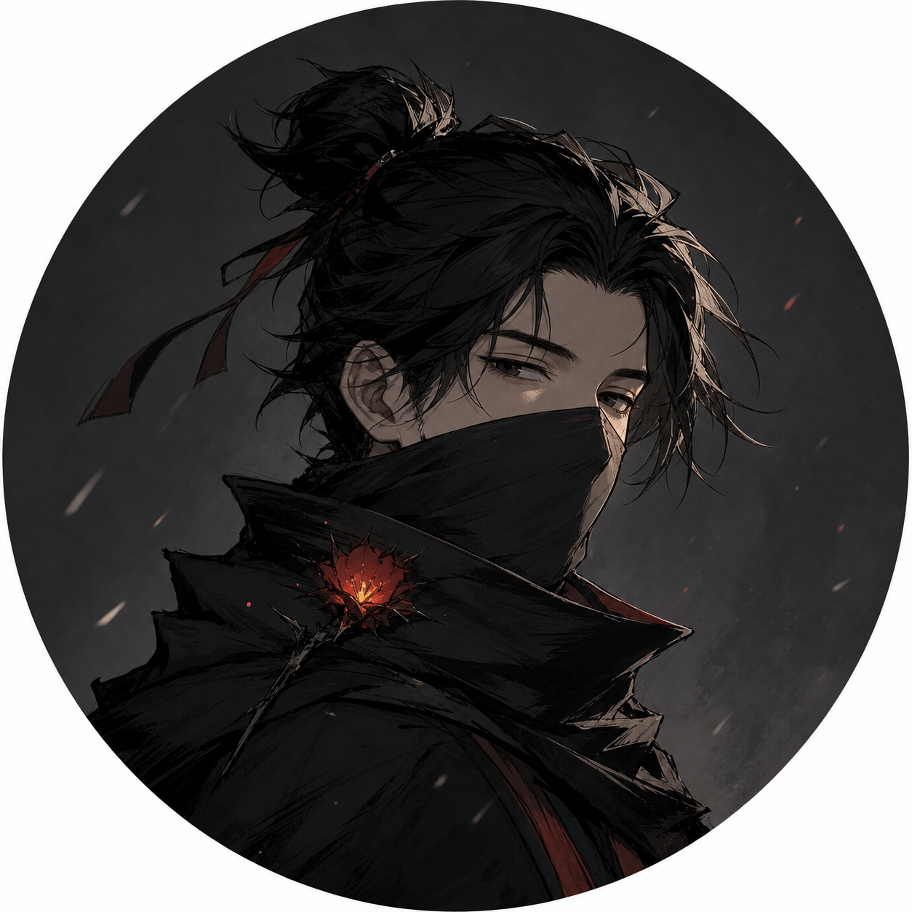

# 《火影忍者》手游4945区补全人物设定 v1

> 文档状态：创作设定稿  
> 适用范围：补足事实基线中资料较少但会承担剧情功能的角色  
> 事实依据：[《4945区剧情基线-v1.md》](./4945区剧情基线-v1.md)  
> 结构依据：[《4945区可玩剧情结构-v1.md》](./4945区可玩剧情结构-v1.md)  
> 二组切片：[《4945区二组线角色场景卡-v1.md》](./4945区二组线角色场景卡-v1.md)  
> 生成头像：[《生成补全-v1》目录](./头像/生成补全-v1/)  

## 0. 事实与创作的边界

用户已经授权对缺失人物设定进行创作补全，但创作内容仍需与真实素材分层：

- 已确认事实：用户提供或事实基线已经登记的身份、日期和行为。
- 创作设定：为群像、分支和对白建立的动机、表达方式及关系。
- 待确认事实：未来若获得真实信息，应优先覆盖创作设定。

补全遵守四项原则：

1. 不改变已经确认的组织归属、职位变化和事件结果。
2. 不把头像外观当成人物现实身份或性格证据。
3. 每个人都拥有独立目标，不只为推动主角剧情而存在。
4. 动机尽量解释行为，但不替行为免责。

## 1. 补全角色总览

| 角色 | 已确认身份 | 创作核心 | 头像 |
|---|---|---|---|
| 先上号再说 | 老玩家朋友、4945小号 | 懂系统、不懂新区人心的引路人 | [查看](./头像/生成补全-v1/先上号再说.png) |
| 顶级奶瓶 | 一组高层、个人榜第5 | 名字最滑稽、办事最严肃的执行者 | [查看](./头像/生成补全-v1/顶级奶瓶.png) |
| 死辛 | 二组成员、个人榜第19 | 忠于活动节奏而非群聊口号的稳定成员 | [查看](./头像/生成补全-v1/死辛.png) |
| 真理 | 三组高层 | 相信证据，但知道证据也需要由组织解释 | [查看](./头像/生成补全-v1/真理.png) |
| OguriC | 五组高层，后为三组高层 | 追随能兑现活动承诺的团队 | [查看](./头像/生成补全-v1/OguriC.png) |
| 温陷 | 五组首领 | 想保住组织名字，却总在风险前多等一步 | [查看](./头像/生成补全-v1/温陷.png) |
| 剑问白玉京 | 五组成员，后升高层 | 在强者离开后负责把组织继续维持下去 | [查看](./头像/生成补全-v1/剑问白玉京.png) |
| AVUCII | 六组高层，后接任首领 | 把情绪化组织收拾成可合并方案的后勤者 | [查看](./头像/生成补全-v1/AVUCII.png) |

## 2. 先上号再说

### 2.1 已确认事实

- 是老区玩家。
- 在4945区使用小号。
- 邀请第一次玩游戏的主角进入新区。
- 不担任前六组织核心管理职位。

### 2.2 创作设定

- 昵称：先上号再说。
- 游戏习惯：任何问题先让人登录、领体力、清日常，再讨论人生。
- 核心欲望：享受带萌新的熟练感，也希望有人陪自己重新体验新区。
- 核心恐惧：被主角顺势推成全天候客服或组织代管。
- 自我认知：认为自己“见得多”，容易把老区经验误当作新区定律。
- 实际优点：系统知识可靠，愿意把复杂机制翻译成短句。
- 实际弱点：对具体人物的判断往往滞后，拿到截图后才开始修正。

### 2.3 信息与行动

- 知道活动、养成和常见组织管理方式。
- 不知道4945各首领的私聊，也不知道希露菲的真实计划。
- 可以替主角转发招募、解释术语、提醒活动时间。
- 不替主角任命高层、发外交公告或决定宣战。

### 2.4 说话方式

- 先给一个能立刻执行的动作，再补原因。
- 经常用“老区一般……”开头，但故事会让这种经验至少错一次。
- 面对群聊大战时不讲大道理，而是问玩家当天日常做完没有。
- 不连续输出教学手册式长消息。

### 2.5 角色弧线

- 序章：他是主角最可靠的信息源。
- 第一幕：他对禁言事故作出过于简单的老区判断。
- 第二幕：两个群都自称官方时，他第一次承认自己也分不清新区秩序。
- 后续：从“教主角怎么玩”转向“尊重主角自己承担首领后果”。

### 2.6 分支反应

- 玩家独立查证：他减少替玩家下结论，信任上升。
- 玩家凡事要求其决定：他明确退出管理讨论。
- 玩家把其错误建议公开当作借口：关系下降。
- 玩家承认自己是萌新但仍承担责任：他愿意继续提供机制帮助。

## 3. 顶级奶瓶

### 3.1 已确认事实

- 一组高层。
- 7月28日个人战力报告为120万，排名第5。
- 是否直接参与二组冲突待确认。

### 3.2 创作设定

- 核心反差：昵称听起来像玩笑，实际是全区最重视表格、出勤和执行的人之一。
- 核心欲望：让一组的第一不是口号，而是每天都能兑现的组织能力。
- 核心恐惧：祈福把一组资源不断投入无法产生收益的群聊战争。
- 对祈福：认可其首领地位，也会在私下指出管理漏洞。
- 对二组：把二组视作真实竞争者，不喜欢用纯粹羞辱代替战力判断。

### 3.3 信息与权限

- 能看到一组管理信息和成员表现。
- 可以执行一组内部管理，但不能替祈福决定整个区群权限。
- 对希露菲身份的了解取决于祈福是否转发申请。
- 如果在骗权前获得完整证据，会要求核验；若事后才知道，则优先控制损失。

### 3.4 说话方式

- 消息数量少，但常包含时间、人数或明确动作。
- 不参与连续刷屏争吵。
- 面对荒唐场面时仍使用严肃工作语气，形成黑色幽默。
- 不因昵称而使用婴儿化语言。

### 3.5 戏剧职责

- 第二幕：在爆群后成为一组内部的止损执行者。
- 第三幕：把祈福的公开立场转换成要塞出勤安排。
- 第四幕：提醒一组“赢得代表权”与“维持成员活跃”是两件事。

### 3.6 分支反应

- 玩家提供完整证据：愿意核验，但不立即接受二组全部叙事。
- 二组正式宣战：集中组织出勤，减少无用口水战。
- 祈福反复扩大冲突：保持公开一致，私下要求收缩。
- 玩家组织管理透明：把玩家视为危险但可以谈判的对手。

## 4. 死辛

### 4.1 已确认事实

- 二组成员。
- 7月28日个人战力报告为101万，排名第19。
- 是二组稳定战力核心之一。

### 4.2 创作设定

- 核心欲望：找到一个活动有人打、奖励有人分、群里不必全天站队的组织。
- 核心恐惧：普通成员被高层情绪绑架，最后还要替管理者解释。
- 忠诚对象：不是某位首领，而是能持续运转的组织习惯。
- 社交方式：多数时间不发言，偶尔用一句很干的评论戳破宏大叙事。

### 4.3 信息与权限

- 只能看到普通成员范围的二组信息。
- 不拥有禁言、任命或踢人权限。
- 能判断实际出勤和成员情绪，不能知道所有外交私聊。
- 不主动传播截图，但看到规则失效时会保留记录。

### 4.4 说话方式

- 短句，少用感叹号。
- 不抢第一轮发言，常在争论接近失控时出现。
- 更关心“这个处理以后还算不算数”。
- 黑色幽默来自一本正经地把群战还原成活动出勤。

### 4.5 戏剧职责

- 第一幕：作为普通成员观察高层权限是否受到约束。
- 第二幕：在爆群后代表“只想正常玩”的多数成员。
- 第三幕：用真实出勤检验二组口号。
- 尾声：辰逸一天没上线时，他的普通成员视角能强化反高潮。

### 4.6 分支反应

- 玩家公开规则并同样约束高层：支持。
- 玩家只处罚自己不喜欢的人：转为观望。
- 玩家接受激将宣战但没有战备：公开质疑。
- 玩家战败后如实说明：可以继续留下。

## 5. 真理

### 5.1 已确认事实

- 三组高层。
- 7月28日仍是三组高层。
- 与OguriC进入管理层后的关系待确认。

### 5.2 创作设定

- 核心欲望：让三组的决定看起来有证据、有程序，也确实能够执行。
- 核心恐惧：新加入的高战力人物绕过原管理层，直接改变三组方向。
- 矛盾点：真心相信证据重要，但会选择先展示最有利于三组的证据。
- 对心跳成瘾：认可其扩张能力，负责提醒扩张的内部成本。

### 5.3 信息与权限

- 能看到三组管理讨论和进入三组的材料。
- 只能通过转发了解二组禁言事件。
- 会要求截图来源、时间和上下文。
- 无权要求其他组织提交全部内部记录。

### 5.4 说话方式

- 经常拆分“已知”“推测”“要处理的问题”。
- 公告语言严谨，私聊里会直接讨论三组收益。
- 不使用“我绝对客观”作为口头禅，客观性通过行为表现。

### 5.5 戏剧职责

- 第一幕：使辰逸对三组的攻击不能只停留在骂战。
- 第三幕：审查三四组联盟信息，防止共享情报变成替别人承担成本。
- 第四幕：处理OguriC等新成员进入后的职位公平。

### 5.6 分支反应

- 玩家公开完整上下文：降低对二组的敌意，但仍要求制度。
- 玩家只发有利截图：抓住缺口并扩大质疑。
- 三组吸收五组全体：要求职位和奖励规则先落地。
- 心跳成瘾只看战力：与其产生管理摩擦。

## 6. OguriC

### 6.1 已确认事实

- 五组开服期高层。
- 五组战败后进入三组。
- 7月28日为三组高层。
- 加入三组的具体谈判条件待确认。

### 6.2 创作设定

- 核心欲望：进入一个能稳定组织活动、兑现战前承诺的团队。
- 核心恐惧：自己承担主要出勤，首领却把失败全部解释成运气。
- 对组织的看法：名字和情谊有价值，但不能长期替代执行。
- 对时：两人都经历从五组流出，但OguriC更晚离开；创作上可让其把时的先行离开视为一次预警，而不是私人背叛。

### 6.3 信息与权限

- 在五组时掌握高层范围的出勤和成员状态。
- 进入三组后不能自动保留五组管理资料的使用权。
- 是否把五组情报交给三组由玩家与其关系决定。

### 6.4 说话方式

- 先谈目标、出勤和失败条件。
- 不喜欢空泛忠诚测试。
- 接受换组织时不发表“永远效忠”的声明，而是确认活动安排和职责。

### 6.5 戏剧职责

- 序章后：时离开五组，使OguriC承担更多初期管理。
- 第三幕：火2战前成为五组真实执行能力的测量者。
- 第四幕：其转入三组让“吸收”具有实际战力，也制造旧成员与新人的职位问题。

### 6.6 分支反应

- 五组首领建立清楚战备：即使战败也可能留下。
- 五组为面子开战且无出勤：默认离开倾向增强。
- 三组只想挖战力：加入但保持观望。
- 三组提供明确职位规则：愿意长期承担管理。

## 7. 温陷

### 7.1 已确认事实

- 五组“未闻花名”首领。
- 默认历史中五组挑战二组失败后仍然存在。
- 对合并的真实态度待确认。

### 7.2 创作设定

- 核心欲望：保住未闻花名这个组织以及自己最初招来的成员。
- 核心恐惧：公开承认五组实力不足后，成员立即把组织当成临时跳板。
- 管理方式：愿意听取不同意见，但经常把明确决定推迟到“再看看”。
- 主要矛盾：告白需要通过战争证明五组；温陷更在意战争后还有没有五组。

### 7.3 信息与权限

- 拥有五组首领权限。
- 能决定是否批准火2战书、任命高层和谈判合并。
- 无法阻止成员自行申请其他组织。
- 时在7月19日离开是其早期管理压力的一部分。

### 7.4 说话方式

- 先承认各方都有理由，再尝试争取更多时间。
- 对成员私聊温和，对公开公告保持模糊。
- 被迫作决定时语言会突然变得很短。
- 不写成单纯懦弱；拖延有时确实可以避免无准备冲突。

### 7.5 戏剧职责

- 序章：承受时离开后的职位空缺。
- 第二幕：决定五组是否借一二组冲突提升存在感。
- 第三幕：玩家非五组路线中，默认受告白推动批准火2挑战。
- 第四幕：在“保名字、保成员、保资源”之间无法三者兼得。

### 7.6 分支反应

- 告白提供完整战备：可能批准挑战。
- 只有激将和面子诉求：倾向拖延或投票。
- 三组提出完整吸收：要求保留一批普通成员位置。
- 玩家帮助五组保住独立资源：更愿意拒绝合并。

## 8. 剑问白玉京

### 8.1 已确认事实

- 五组成员。
- 默认历史中五组核心成员流失后升任高层。
- 7月28日为五组高层。
- 另一名现任高层待确认。

### 8.2 创作设定

- 核心欲望：让未闻花名在强者离开后仍是一个能运行的组织。
- 核心恐惧：所有人只把留下者称作“没地方去的人”。
- 权力态度：不主动争夺开服期高层，但在空缺出现时愿意接下具体工作。
- 对温陷：尊重其保留组织的意愿，也会要求其停止无限推迟决定。

### 8.3 信息与权限

- 初期只拥有普通成员信息。
- 升任后才得到高层权限。
- 更熟悉留守成员的真实需求，不掌握离开核心的所有谈判。

### 8.4 说话方式

- 使用具体任务表达忠诚：补人、登记、提醒活动。
- 不发表悲壮宣言。
- 面对“组织已经死了”的说法，会用仍有人上线和完成活动反驳。

### 8.5 戏剧职责

- 第三幕：作为普通成员承担战书的真实成本。
- 第四幕：证明五组没有因核心离开就被系统删除。
- 结局：把“保住名字”区分为实际重建与空壳维持。

### 8.6 分支反应

- 温陷建立重建计划：支持并接受高层。
- 温陷只想保留名义：要求实际分工。
- 五组整体合并且普通成员有位置：可以接受结束组织。
- 核心成员私下挖人：优先保护留守名单。

## 9. AVUCII

### 9.1 已确认事实

- 六组高层。
- yyT离任后由AVUCII接任首领。
- 默认历史中六组最终并入二组并解散。
- 接任、合并和解散的准确顺序与日期待确认。

### 9.2 创作设定

- 核心欲望：让加入六组的人在组织结束或转型时仍有明确去处。
- 核心恐惧：yyT把群聊冲突当成组织战略，留下无法收拾的成员和承诺。
- 管理方式：不善于号召，但擅长名单、交接和谈判。
- 权力态度：接任不是为了证明自己比yyT强，而是因为必须有人完成善后。

### 9.3 信息与权限

- 高层时期掌握六组内部名单和活动状态。
- 接任前不能替yyT发布首领决定。
- 接任后可以谈判合并，但必须处理皇帝等核心成员去向。
- 无法要求二组无条件接纳所有人。

### 9.4 说话方式

- 使用清单式表达，但不机械报数字。
- 冲突时先确认“谁还在、谁能上线、谁愿意去哪”。
- 很少参与公开激将。
- 对合并不使用“投降”或“吞并”的情绪词，强调具体安排。

### 9.5 戏剧职责

- 第二幕：在yyT与祈福冲突前后观察六组合法性变化。
- 第三幕：把有限出勤变成对外谈判资源。
- 第四幕：接任首领并与二组谈判默认合并。
- 玩家第六组织路线：成为稳健高层或接班候选，不能无条件夺走玩家职位。

### 9.6 分支反应

- yyT个人冲突被及时切割：继续担任高层。
- 六组资源耗尽且无人愿意承担：推动合并。
- 二组提供明确成员位置：支持并入。
- 玩家第六组织建立可持续资源：支持保持独立。
- 玩家只喊独立却没有活动计划：转为反对。

## 10. 跨角色关系

| 关系 | 创作张力 | 默认发展 |
|---|---|---|
| 祈福—顶级奶瓶 | 祈福掌握公开权威，奶瓶负责把权威变成执行 | 爆群后奶瓶参与止损 |
| 玩家—死辛 | 玩家需要普通成员信任，死辛只看制度是否长期有效 | 玩家约束高层则支持 |
| 心跳成瘾—真理 | 一个擅长扩张，一个要求扩张有程序 | 吸收五组时产生管理摩擦 |
| 时—OguriC | 两人先后离开五组，代表不同阶段的人才流失 | 时先走成为OguriC的预警 |
| 温陷—告白 | 生存优先与面子战争的冲突 | 默认走向火2挑战 |
| 温陷—剑问白玉京 | 一个保留名字，一个要求名字背后有实际工作 | 战后共同维持五组 |
| yyT—AVUCII | 公开冲突能力与善后能力的对照 | AVUCII接任并处理合并 |

## 11. 接入剧情的顺序

### 二组垂直切片立即接入

- 先上号再说：替代老玩家朋友占位角色。
- 死辛：作为二组普通成员群像进入禁言、改组和宣战讨论。
- 顶级奶瓶：在旧区群爆破后作为一组止损角色短暂出现。
- 真理：在《与世界为敌Ⅰ》中代表三组管理层要求二组说明。

### 第二次要塞阶段接入

- OguriC：五组战备与出勤执行。
- 温陷：批准、否决或拖延火2挑战。
- 剑问白玉京：普通成员承担战争成本。
- AVUCII：六组对外合作与内部交接。

### 战后重组阶段接入

- 真理与OguriC：三组原管理层和新高层的权力磨合。
- 温陷与剑问白玉京：五组是实际重建还是只保留名字。
- AVUCII：六组接任、谈判、并入与解散。

## 12. 后续覆盖规则

未来获得真实资料时：

1. 组织、日期、职位和真实行为直接覆盖同类创作内容。
2. 若真实动机与创作设定不同，保留创作设定作为玩家世界线或虚构改编备选，不再标成默认人物动机。
3. 头像可以继续保留为虚构改编形象，除非用户提供替换图。
4. 已写对白必须随事实变更重新检查，不能只修改人物表。
5. 事实基线继续作为历史真值来源，本稿不反向把创作内容写成事实。

## 13. 完成边界

本稿已经完成：

- 8名缺失主要人物的创作设定。
- 每人的目标、恐惧、信息、权限、语言和分支反应。
- 与公共事件的接入时机。
- 跨组织关系和未来事实覆盖规则。

本稿有意没有完成：

- 排名背景人物的设定。
- 未命名高层的占位人物。
- 正式对白。
- 玩家主角的固定外貌与性格。

